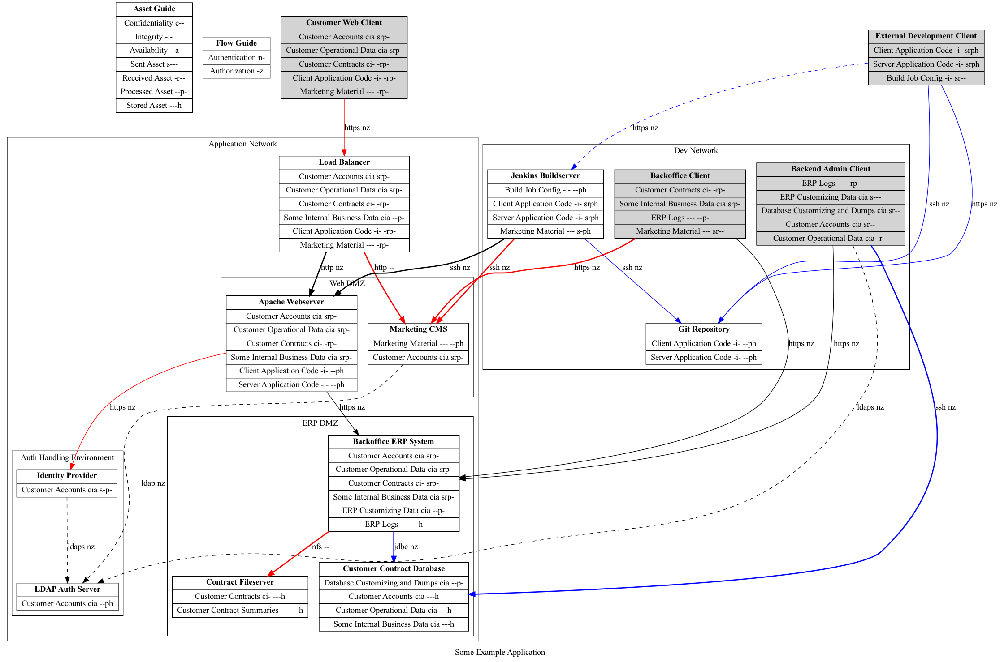

# Threagile Experimental Utilities

schemautil.py: JSON/YAML complementer using a schema file
model2dot.py: Yet another DFD generator using a Threagile model structure

# Usage

    schemautils.py -schema schema.json -yaml minimum.yaml -out complemented.yaml [-addsample]
    model2dot.py -yaml threagile-model.yaml -out data-flow-diagram.dot
    dot -Tpng -odata-flow-diagram.png data-flow-diagram.dot

# Example

